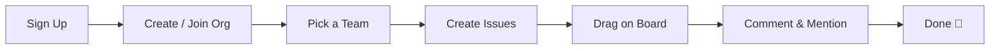
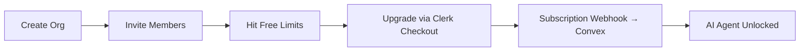
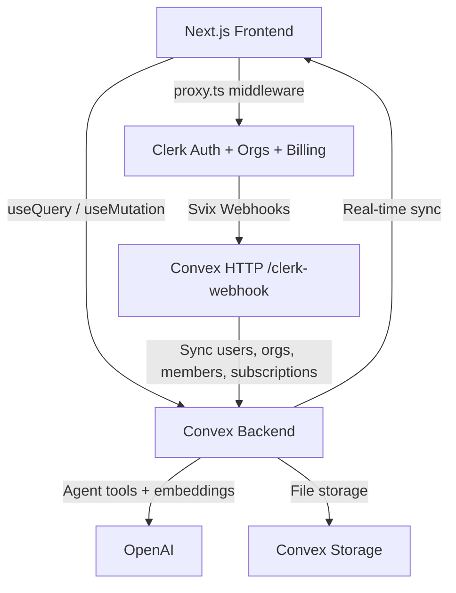

# Vector — Linear-Style Project Management for Teams

[](LICENSE.md)
[](https://nextjs.org/)
[](https://convex.dev)
[](https://go.clerk.com/Mzf8gfM)
[](https://tailwindcss.com/)
[](https://www.typescriptlang.org/)

> **⚠️ Disclaimer:** This is an **educational project** built for learning purposes only. "Vector" is a fictional name used for this demo — we do not claim any trademark or intellectual property rights over it. This project is **not affiliated with, endorsed by, or connected to Linear, Jira, Asana, or any other project management platform**. All organization names, issues, and user data in the seed files are entirely fictional. Third-party service names (Clerk, Convex, Vercel, Next.js, OpenAI, Tailwind CSS, etc.) are trademarks of their respective owners and are used here solely to describe the technologies used in this project.

A full-stack, real-time **Linear clone** — a B2B multi-tenant SaaS issue tracker where teams manage issues on Kanban boards, plan projects and cycles, collaborate with comments and mentions, and ship faster with a built-in **AI agent** that knows their entire workspace.

> **Who is this for?**
> Anyone who wants to learn how to build a production-grade, multi-tenant B2B SaaS using modern tools — or anyone looking for a serious starter template for their own project management product.

> **What makes it different?**
> Every update is **real-time** (no page refreshes). Auth, organizations, AND billing are handled by **Clerk** — no Stripe wiring required. The backend is powered by **Convex** — a reactive database that pushes changes to every connected client instantly. And there's a fully working **AI agent** (Convex Agent + OpenAI) with org-scoped tools, triage assist, duplicate detection, and rate limiting.

> **Under the hood**
> Next.js 16 App Router · Convex reactive backend · Clerk auth + organizations + B2B billing · Convex Agent + OpenAI · @dnd-kit drag & drop · shadcn/ui · Tailwind CSS v4 · TypeScript strict mode

---

## 👇🏼 DO THIS Before You Get Started

You'll need free accounts on these services to run the app. **Set them up before cloning:**

| Service                 | What it does                                                 | Sign up                                                                  |
| ----------------------- | ------------------------------------------------------------ | ------------------------------------------------------------------------ |
| **Clerk**               | Authentication, organizations, and B2B subscription billing  | [Create a free Clerk account →](https://go.clerk.com/Mzf8gfM)            |
| **Convex**              | Real-time backend, database, vector search, and file storage | [Create a free Convex account →](https://convex.dev/referral/SONNYS4371) |
| **OpenAI**              | Powers the AI agent, triage assist, and duplicate detection  | [platform.openai.com →](https://platform.openai.com)                     |
| **Vercel** _(optional)_ | Deployment & hosting                                         | [vercel.com →](https://vercel.com)                                       |

---

## 🤔 What Is This App?

Think of Vector as **your own mini Linear** — a modern issue tracker built from scratch as a learning project, with the same keyboard-first, dense, dark-mode-default aesthetic.

It's a multi-tenant workspace app. Every organization gets its own isolated workspace, and members collaborate inside it in real time:

**As a team member**, you can:

- Create and manage issues with statuses, priorities, assignees, estimates, due dates, and labels
- Drag issues across a **Kanban board** that updates for everyone instantly
- Search the entire workspace with full-text search and save filtered views
- Comment on issues with **@mentions**, attach files, link related issues, and break work into sub-issues
- See who else is viewing an issue with **live presence**
- Fly through everything with a **command palette (⌘K)** and single-key shortcuts

**As a workspace admin**, you can:

- Organize work into **teams** (each with its own issue prefix like `ENG-123`), **projects**, and **cycles** (sprints)
- Invite members and manage roles
- Upgrade the workspace and manage billing — checkout, plan changes, and invoices all handled by Clerk
- Unlock the **AI agent** on paid plans

**The AI agent** (Pro/Enterprise) can:

- Create, update, and search issues for you using natural language
- Summarize cycles, report project status, and generate standups
- Detect duplicate issues using vector embeddings
- Triage new issues automatically

**Popular use cases:**

- 🎓 **Portfolio project** — show off a real multi-tenant B2B SaaS to employers
- 🚀 **SaaS starter** — fork it and turn it into your own productivity tool
- 📚 **Learn the modern stack** — see exactly how Convex, Clerk billing, and AI agents fit together

---

## 🚀 Before We Dive In — Join the PAPAFAM!

Want to build apps like this from scratch? Learn how to **code with AI the right way** — using Cursor and AI agents as force multipliers, not crutches.

### What You'll Master

- ⚡ **Next.js 16** — App Router, Server Components, route groups, and `proxy.ts` middleware
- 🔐 **Clerk** — Authentication, organizations, role-based access, and B2B subscription billing
- 🗄️ **Convex** — Real-time reactive backend, vector search, file storage, and schema design
- 🤖 **AI-Powered Development** — Learn to code with AI the right way: plan, parallelize, review, and ship with Cursor instead of blindly accepting output
- 🎨 **Modern UI** — shadcn/ui, Tailwind CSS v4, dark mode, and keyboard-first UX patterns

### The PAPAFAM Community

- 💬 Join thousands of developers building together
- 🏆 Real results from graduates who landed jobs and launched products
- 📦 Full course materials, starter code, and lifetime access

### What's Included

- Step-by-step video walkthroughs of real-world builds
- Private community access
- Code reviews and Q&A support
- Regular new project drops

👉 **[Join the PAPAFAM and start building →](https://www.papareact.com/course)**

---

## ✨ Features

### Issues & Boards

- 📝 **Full issue tracking** — Statuses (Backlog → Todo → In Progress → In Review → Done / Canceled), five priority levels, assignees, estimates, due dates, and color-coded labels
- 🔢 **Team-scoped issue keys** — Every team gets a prefix, so issues read like `ENG-42` or `DESIGN-7`
- 🗂️ **Kanban board** — Drag & drop with @dnd-kit and fractional sort ordering; every move syncs to all clients instantly
- 🔍 **Full-text search** — Convex search indexes across issue titles and descriptions, scoped to your workspace
- 💾 **Saved views** — Save filter combinations as personal or shared views
- ⌨️ **Command palette** — ⌘K for everything, plus single-key shortcuts (Linear style)

### Collaboration

- 💬 **Comments with @mentions** — Mention teammates by name in issue discussions
- 📜 **Activity feed** — Every status change, assignment, and label is logged and rendered on the issue
- 🌳 **Sub-issues & relations** — Break work down with parent/child issues; link issues as _blocks_, _blocked by_, _related_, or _duplicate of_
- 📎 **Attachments** — Upload files to issues using Convex file storage
- 🟢 **Live presence** — See who's viewing the same issue in real time

### Projects & Cycles

- 📊 **Projects** — Group issues across teams with statuses, leads, target dates, and live progress (issue counts by status)
- 🔄 **Cycles** — Time-boxed sprints per team, auto-numbered, with current-cycle tracking
- 🏗️ **Multi-team workspaces** — Unlimited teams per organization, each with its own board and cycles

### AI Agent (Pro & Enterprise)

- 🤖 **Workspace-aware chat** — A Convex Agent + OpenAI assistant with org-scoped tools: create/update/search issues, summarize cycles, report project status, list members
- 🧠 **Duplicate detection** — Issues are embedded (1536-dim vectors) on create; the agent finds semantically similar issues before you file the same bug twice
- 🩺 **Triage assist** — AI-suggested priority and labels for new issues
- 📋 **Standup & cycle reports** — Generate summaries of what shipped and what's blocked
- ⏱️ **Rate limiting** — 50 messages/user/day on Pro, unlimited on Enterprise (`@convex-dev/rate-limiter`)

### Billing & Multi-Tenancy

- 🏢 **Clerk Organizations** — Every workspace is a Clerk organization; memberships and roles sync to Convex via webhooks
- 💳 **Clerk B2B Billing** — Custom-designed pricing page with checkout, plan management, and invoices handled entirely by Clerk (no Stripe integration to write)
- 🔐 **Plan gating, done right** — UI gates with `has({ plan })` / `has({ feature })` are cosmetic; Convex mutations are the real enforcement
- 🚦 **Free-tier limits** — Seats, projects, and issue caps enforced server-side with friendly upgrade prompts in the UI

### Pricing Tiers

|                      | Free | Pro ($20/mo)                           | Enterprise ($99/mo) |
| -------------------- | ---- | -------------------------------------- | ------------------- |
| **Members**          | 3    | 10 (seat-based, +$10/seat after first) | Unlimited           |
| **Projects**         | 2    | Unlimited                              | Unlimited           |
| **Issues**           | 100  | Unlimited                              | Unlimited           |
| **AI agent**         | —    | ✅ 50 msgs/user/day                    | ✅ Unlimited        |
| **Priority support** | —    | —                                      | ✅                  |

_Annual billing: Pro $16/mo-equivalent, Enterprise $79/mo-equivalent._

### Technical Features (The Smart Stuff)

- ⚛️ **Next.js 16 App Router** — Route groups for marketing vs. app shell, dynamic `[orgSlug]` workspace routes, `proxy.ts` middleware
- 🔄 **Convex reactive backend** — No polling, no refetching. Queries are live subscriptions
- 🛡️ **Custom function wrappers** — `orgQuery` / `orgMutation` resolve the user, org, and membership from the Clerk JWT and enforce org scoping on every single function (Convex's answer to RLS)
- 🔐 **Clerk webhooks → Convex** — Users, organizations, memberships, and subscriptions sync via Svix-verified webhooks; Clerk stays the source of truth
- 🧩 **Convex components** — `@convex-dev/agent` (AI), `@convex-dev/presence` (live presence), `@convex-dev/rate-limiter` (AI quotas)
- 🔎 **Search + vector indexes** — Full-text search indexes and a 1536-dimension vector index, both defined in the schema
- 🖱️ **@dnd-kit drag & drop** — With fractional `sortOrder` ranking so reorders are O(1) writes
- 🧩 **shadcn/ui + Tailwind CSS v4** — Linear-style density, dark theme by default, light mode via `next-themes`
- ✅ **Validators everywhere** — Every public Convex function validates args AND return values

---

## 🔄 How It Works

### Team Member Flow



### Admin / Billing Flow



### Architecture Overview



---

## 🏁 Getting Started

### Prerequisites

- **Node.js** 18 or later
- **pnpm** (package manager) — `npm install -g pnpm`
- A **[Clerk](https://go.clerk.com/Mzf8gfM)** account
- A **[Convex](https://convex.dev/referral/SONNYS4371)** account
- An **[OpenAI](https://platform.openai.com)** API key (for the AI agent)

### 1. Clone the repository

```bash
git clone https://github.com/sonnysangha/linear-clone-clerk-nextjs-16.git
cd linear-clone-clerk-nextjs-16
```

### 2. Install dependencies

```bash
pnpm install
```

### 3. Set up environment variables

Create a `.env.local` file in the project root:

```env
# Clerk — https://go.clerk.com/Mzf8gfM
NEXT_PUBLIC_CLERK_PUBLISHABLE_KEY=pk_test_...
CLERK_SECRET_KEY=sk_test_...
NEXT_PUBLIC_CLERK_FRONTEND_API_URL=https://your-instance.clerk.accounts.dev

# Clerk routing
NEXT_PUBLIC_CLERK_SIGN_IN_URL=/sign-in
NEXT_PUBLIC_CLERK_SIGN_UP_URL=/sign-up
NEXT_PUBLIC_CLERK_SIGN_IN_FALLBACK_REDIRECT_URL=/onboarding
NEXT_PUBLIC_CLERK_SIGN_UP_FALLBACK_REDIRECT_URL=/onboarding

# Convex — https://convex.dev/referral/SONNYS4371
CONVEX_DEPLOYMENT=dev:your-deployment
NEXT_PUBLIC_CONVEX_URL=https://your-deployment.convex.cloud
NEXT_PUBLIC_CONVEX_SITE_URL=https://your-deployment.convex.site
```

> 🔒 **Security:** Never commit `.env.local` to git. The `NEXT_PUBLIC_` prefix means the value is exposed to the browser — only use it for public keys like `NEXT_PUBLIC_CLERK_PUBLISHABLE_KEY`.

### 4. Set up Clerk

1. Go to your [Clerk Dashboard](https://go.clerk.com/Mzf8gfM) and create a new application
2. Copy your **Publishable Key**, **Secret Key**, and **Frontend API URL** into `.env.local`
3. Enable **Organizations** (Configure → Organizations)
4. Create a **JWT template** named exactly `convex`, and add these custom claims so Convex knows the active organization:

```json
{
  "org_id": "{{org.id}}",
  "org_slug": "{{org.slug}}",
  "org_role": "{{org.role}}"
}
```

5. Set up **Billing** (Configure → Billing) with three plans for **organizations**:
   - `free_org` — Free
   - `pro` — $20/mo base + $10/seat after the first (annual: $16/mo-equivalent), max 10 members
   - `enterprise` — $99/mo flat (annual: $79/mo-equivalent)
6. Attach **features** to the paid plans: `ai_agent`, `unlimited_projects`, `unlimited_issues`, `unlimited_seats`, `unlimited_ai`, `priority_support`
7. Copy your plan IDs into [`lib/plans.ts`](lib/plans.ts) (they're referenced there, never inline in components)

### 5. Set up Convex

1. Run `npx convex dev` — this will prompt you to create a new project or link an existing one, and fills in `CONVEX_DEPLOYMENT` / `NEXT_PUBLIC_CONVEX_URL` for you
2. Set these environment variables in the [Convex dashboard](https://dashboard.convex.dev) (Settings → Environment Variables) — or via the CLI:

```bash
npx convex env set CLERK_FRONTEND_API_URL https://your-instance.clerk.accounts.dev
npx convex env set CLERK_WEBHOOK_SECRET whsec_...   # from step 6 below
npx convex env set OPENAI_API_KEY sk-...            # for the AI agent
```

### 6. Configure Clerk Webhooks

This is how Clerk keeps your Convex database in sync with users, organizations, memberships, and subscriptions.

1. In your Clerk dashboard, go to **Webhooks** and create a new endpoint
2. Set the URL to your Convex **HTTP Actions URL** + `/clerk-webhook`:
   - e.g. `https://your-deployment.convex.site/clerk-webhook` (note: `.convex.site`, not `.convex.cloud`)
3. Subscribe to these events:
   - `user.created` / `user.updated` / `user.deleted`
   - `organization.created` / `organization.updated` / `organization.deleted`
   - `organizationMembership.created` / `organizationMembership.updated` / `organizationMembership.deleted`
   - All `subscription.*` and `subscriptionItem.*` events (this is how plan changes reach Convex)
4. Copy the **Signing Secret** and set it as `CLERK_WEBHOOK_SECRET` in your Convex environment variables (step 5)

### 7. Run the development server

```bash
pnpm dev
```

This runs the Next.js frontend and the Convex backend in parallel. Open [http://localhost:3000](http://localhost:3000), sign up, create an organization on the onboarding screen, and you're in.

### First-Time Setup Checklist

- [ ] Clerk account created and keys added to `.env.local`
- [ ] Clerk Organizations enabled
- [ ] Clerk JWT template `convex` created with `org_id` / `org_slug` / `org_role` claims
- [ ] Clerk Billing plans (`free_org`, `pro`, `enterprise`) and features configured
- [ ] Convex project linked; `CLERK_FRONTEND_API_URL`, `CLERK_WEBHOOK_SECRET`, and `OPENAI_API_KEY` set in Convex env vars
- [ ] Clerk webhook pointing at `https://<deployment>.convex.site/clerk-webhook`
- [ ] `pnpm dev` runs without errors
- [ ] You can sign up, create an org, and create your first issue

---

## 🗄️ Database Schema Overview

Vector uses **Convex** as its database with a flat, relational schema design. All tables are defined in [`convex/schema.ts`](convex/schema.ts).

| Table                        | Purpose                           | Key Fields                                                                       |
| ---------------------------- | --------------------------------- | -------------------------------------------------------------------------------- |
| **users**                    | Synced from Clerk via webhooks    | `clerkId`, `name`, `email`, `imageUrl`                                           |
| **organizations**            | Synced from Clerk Organizations   | `clerkOrgId`, `slug`, `plan`, `subscriptionStatus`                               |
| **members**                  | Org membership with roles         | `orgId`, `userId`, `role`, `clerkMembershipId`                                   |
| **teams**                    | Teams within an org               | `orgId`, `name`, `key` (issue prefix), `nextIssueNumber`                         |
| **issues**                   | The core entity                   | `teamId`, `number`, `status`, `priority`, `assigneeId`, `sortOrder`, `embedding` |
| **labels** / **issueLabels** | Color-coded labels (many-to-many) | `name`, `color` / `issueId`, `labelId`                                           |
| **issueRelations**           | Links between issues              | `issueId`, `relatedIssueId`, `type` (blocks, related, duplicate…)                |
| **comments**                 | Issue discussions                 | `issueId`, `authorId`, `body`, `mentions[]`                                      |
| **activity**                 | Audit trail per issue             | `issueId`, `actorId`, `type`, `oldValue`, `newValue`                             |
| **projects**                 | Cross-team initiatives            | `orgId`, `status`, `leadId`, `targetDate`                                        |
| **cycles**                   | Sprints per team                  | `teamId`, `number`, `startDate`, `endDate`                                       |
| **attachments**              | Files on issues (Convex storage)  | `issueId`, `storageId`, `fileName`, `fileSize`                                   |
| **views**                    | Saved filter configurations       | `creatorId`, `filters` (JSON), `shared`                                          |

### Design Decisions

- **Flat, relational design** — No deep nesting. Tables reference each other by ID, following Convex best practices.
- **Clerk is the source of truth** — `users`, `organizations`, and `members` are only ever written by webhooks. Feature code never touches them.
- **Org scoping everywhere** — Almost every table carries `orgId`, and every Convex function runs through `orgQuery` / `orgMutation` wrappers that verify membership before touching data.
- **Per-team issue sequences** — `teams.nextIssueNumber` powers `ENG-1`, `ENG-2`, … without global counters.
- **Fractional `sortOrder`** — Board reorders write one document instead of renumbering a whole column.
- **Search + vector indexes in the schema** — Full-text indexes on title/description, plus a 1536-dim vector index on `embedding` for AI duplicate detection.

---

## 🚀 Deployment

### Deploy to Vercel

**Option A: Vercel CLI**

```bash
pnpm install -g vercel
vercel
```

**Option B: GitHub Integration**

1. Push your repo to GitHub
2. Go to [vercel.com/new](https://vercel.com/new)
3. Import your repository
4. Add all environment variables from `.env.local`
5. Deploy

### Deploy Convex to Production

```bash
npx convex deploy
```

This deploys your Convex functions and schema to a production deployment. Set `CLERK_FRONTEND_API_URL`, `CLERK_WEBHOOK_SECRET`, and `OPENAI_API_KEY` in the Convex **production** dashboard too.

### Post-Deployment Checklist

- [ ] All environment variables set in Vercel (including `NEXT_PUBLIC_` vars)
- [ ] All environment variables set in Convex production
- [ ] Clerk webhook endpoint updated to the **production** Convex HTTP Actions URL
- [ ] Clerk production API keys used (not development keys)
- [ ] Clerk Organizations, JWT template, and Billing configured on the production instance
- [ ] Test sign-up → create org → create issue → upgrade plan → AI chat, end-to-end

---

## 🐛 Common Issues & Solutions

### Development

| Problem                            | Solution                                                                                                                           |
| ---------------------------------- | ---------------------------------------------------------------------------------------------------------------------------------- |
| `pnpm dev` only starts one server  | The `dev` script uses `npm-run-all` to run `dev:frontend` and `dev:backend` in parallel. Run `pnpm install` again if it's missing. |
| Convex types not updating          | Keep `npx convex dev` running. It generates types into `convex/_generated/`.                                                       |
| Page shows a loading state forever | Check that `NEXT_PUBLIC_CONVEX_URL` is correct in `.env.local`.                                                                    |

### Authentication & Organizations

| Problem                                    | Solution                                                                                                                            |
| ------------------------------------------ | ----------------------------------------------------------------------------------------------------------------------------------- |
| "Not authenticated" errors from Convex     | The JWT template must be named exactly `convex`, and `CLERK_FRONTEND_API_URL` must be set on the Convex deployment.                 |
| Org pages 404 or redirect to onboarding    | The JWT template needs the `org_id` / `org_slug` / `org_role` custom claims, and you must have an **active organization** selected. |
| Webhook returns 400                        | Verify the signing secret matches `CLERK_WEBHOOK_SECRET` in Convex (not `CLERK_SECRET_KEY`).                                        |
| User signs up but doesn't appear in Convex | Check the webhook endpoint URL ends with `/clerk-webhook` and uses the `.convex.site` domain.                                       |

### Billing & AI

| Problem                                      | Solution                                                                                                                                        |
| -------------------------------------------- | ----------------------------------------------------------------------------------------------------------------------------------------------- |
| Plan not updating after checkout             | Make sure all `subscription.*` and `subscriptionItem.*` events are subscribed on the webhook. The plan syncs to `organizations.plan` in Convex. |
| AI page says upgrade required on a paid plan | AI access is gated by plan in Convex (`hasAiAccess`). Confirm the subscription webhook fired and the org's plan is `pro` or `enterprise`.       |
| AI chat errors immediately                   | Set `OPENAI_API_KEY` on the Convex deployment: `npx convex env set OPENAI_API_KEY sk-...`                                                       |
| AI stops responding mid-day                  | Pro is rate-limited to 50 messages/user/day. Enterprise is unlimited.                                                                           |

### Database

| Problem                                | Solution                                                                                     |
| -------------------------------------- | -------------------------------------------------------------------------------------------- |
| "Index not found" error                | Run `npx convex dev` to push your schema. Indexes are defined in `convex/schema.ts`.         |
| Schema validation errors after changes | If you change field types, you may need to clear and re-seed data from the Convex dashboard. |

---

## 🏆 Take It Further — Challenge Time!

Already have the base app running? Here are some ideas to make it your own:

### Advanced Features

- 📥 **Inbox & notifications** — In-app notification feed for mentions, assignments, and status changes
- 🗺️ **Roadmap view** — Timeline/Gantt visualization of projects and target dates
- 📊 **Cycle analytics** — Burndown charts, velocity, and scope-change tracking
- 🔁 **Issue templates & recurring issues** — Standardize bug reports and rituals

### AI Improvements

- ✍️ **AI issue drafting** — Turn a one-line idea into a fully specced issue with acceptance criteria
- 🧹 **Backlog grooming agent** — Let the AI suggest stale issues to close and duplicates to merge
- 🗣️ **Voice standup** — Speech-to-text standup notes summarized into a cycle report
- 🔗 **GitHub integration** — Link PRs to issues and let the agent update statuses on merge

### Infrastructure & Scaling

- 📈 **Pagination** — Cursor-based pagination for orgs with tens of thousands of issues
- 🌐 **Public issue sharing** — Read-only public links for individual issues
- 📦 **Import/export** — Bring in issues from CSV, Jira, or the real Linear's export format

### Monetization

- 💺 **Per-seat metering** — Track active seats and surface usage on the billing page
- 🏷️ **Add-on features** — Sell the AI agent as a standalone add-on with Clerk features
- 🎁 **Trials** — Time-boxed Pro trials for new organizations

---

## 📜 License & Disclaimer

This project's source code is shared under the [Creative Commons Attribution-NonCommercial 4.0 International License](LICENSE.md) for **educational purposes only**.

### You CAN

- ✅ Use this project for **personal learning and education**
- ✅ Fork it and **modify** it for non-commercial purposes
- ✅ Share it with others (with attribution)
- ✅ Use it as a **portfolio project**
- ✅ Reference it in blog posts and tutorials

### You CANNOT

- ❌ Use it for **commercial purposes** without a separate license
- ❌ Sell it or include it in a paid product
- ❌ Remove the attribution or license notice

### Trademark Notice

"Vector" is a fictional name used for this educational demo. We do not claim any trademark, copyright, or intellectual property rights over this name. If "Vector" is a registered trademark belonging to another party, its use here is unintentional and purely for educational illustration. This project is **not affiliated with, endorsed by, or connected to Linear, Atlassian (Jira), Asana, or any other project management platform or company**. All third-party names and logos (Clerk, Convex, Vercel, Next.js, React, OpenAI, Tailwind CSS, TypeScript, etc.) are trademarks of their respective owners.

See the full [LICENSE.md](LICENSE.md) for details.

---

## 📋 Quick Reference

### Useful Commands

| Command                        | What it does                                         |
| ------------------------------ | ---------------------------------------------------- |
| `pnpm dev`                     | Start both Next.js and Convex in parallel            |
| `pnpm build`                   | Build the Next.js app for production                 |
| `pnpm start`                   | Start the production server                          |
| `pnpm lint`                    | Run ESLint across the project                        |
| `pnpm exec tsc --noEmit`       | Type-check the whole project                         |
| `npx convex dev`               | Start the Convex dev server (auto-generates types)   |
| `npx convex deploy`            | Deploy Convex to production                          |
| `npx convex dashboard`         | Open the Convex dashboard in your browser            |
| `npx convex env set KEY value` | Set an environment variable on the Convex deployment |

### Key Files & Folders

| Path                                                                  | Purpose                                                                          |
| --------------------------------------------------------------------- | -------------------------------------------------------------------------------- |
| `app/(marketing)/`                                                    | Landing page and pricing page (public)                                           |
| `app/(app)/[orgSlug]/`                                                | The workspace: team views, board, issues, projects, cycles, search, AI, settings |
| `app/onboarding/`                                                     | Create-or-join-organization flow after sign-up                                   |
| `app/sign-in/`, `app/sign-up/`                                        | Clerk auth pages                                                                 |
| `convex/schema.ts`                                                    | Database schema — tables, indexes, search & vector indexes                       |
| `convex/http.ts` + `convex/webhooks.ts`                               | Clerk webhook endpoint and sync logic                                            |
| `convex/lib/customFunctions.ts`                                       | `orgQuery` / `orgMutation` wrappers (auth + org scoping)                         |
| `convex/lib/limits.ts`                                                | Free-plan limit enforcement (`assertCanCreateIssue`, etc.)                       |
| `convex/agent/`                                                       | AI agent: chat, tools, embeddings, triage, rate limiting                         |
| `components/ui/`                                                      | shadcn/ui primitives                                                             |
| `components/shell/`                                                   | App shell: sidebar, command palette wiring                                       |
| `components/board/`, `components/issues/`, `components/issue-detail/` | Board, list, and issue detail UI                                                 |
| `lib/plans.ts`                                                        | Single source of truth for Clerk plan IDs, slugs, and pricing display            |
| `proxy.ts`                                                            | Clerk middleware for route protection (Next.js 16)                               |
| `.env.local`                                                          | Environment variables (not committed)                                            |

### Important Concepts

- **Route Groups** — `(marketing)` is the public site; `(app)` is the authenticated workspace. Each has its own layout.
- **Org-Scoped Routes** — Everything in the workspace lives under `/[orgSlug]/...`. The shell guarantees the user and org are synced before pages render.
- **Custom Convex Functions** — `orgQuery` / `orgMutation` resolve `ctx.user`, `ctx.org`, and `ctx.membership` from the Clerk JWT and reject non-members. This is Convex's alternative to Row Level Security.
- **Clerk as Source of Truth** — Users, orgs, memberships, and subscriptions live in Clerk and are mirrored into Convex via webhooks. Feature code never writes to those tables.
- **Two-Layer Plan Gating** — `has({ plan })` / `has({ feature })` in the UI is cosmetic; the Convex helpers in `convex/lib/limits.ts` are the real enforcement.
- **`proxy.ts` Middleware** — Replaces traditional `middleware.ts` in Next.js 16. Protects the app routes while keeping marketing pages public.
