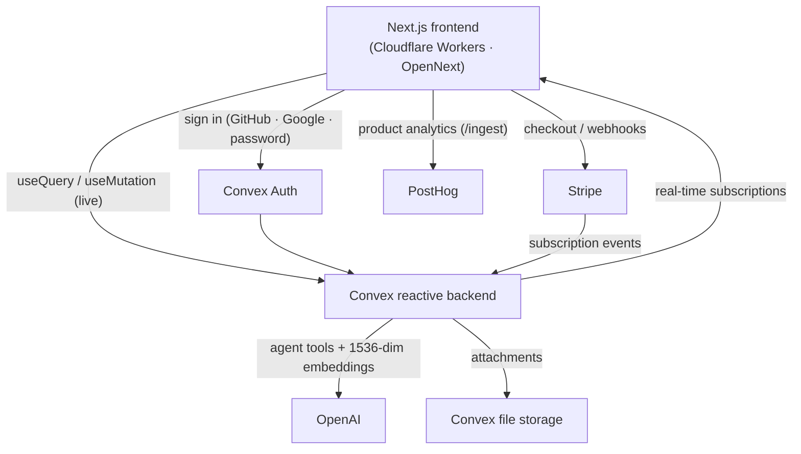

# Manut — The real-time teamwork suite

[](LICENSE.md)
[](https://nextjs.org/)
[](https://convex.dev)
[-F38020?logo=cloudflare&logoColor=white)](https://workers.cloudflare.com/)
[](https://tailwindcss.com/)
[](https://www.typescriptlang.org/)

**Manut** is a full-stack, real-time, multi-tenant **B2B teamwork platform** — Linear-style issue tracking joined with Confluence-lite docs, product discovery, a service desk, roadmaps, rule-based automations, and a workspace-aware **AI agent**. Every change is pushed live to every connected client, with no page refreshes.

🌐 **Marketing:** [manut.xyz](https://manut.xyz) · **App:** [app.manut.xyz](https://app.manut.xyz)

---

## Table of contents

- [What is Manut?](#what-is-manut)
- [The suite](#the-suite)
- [Features](#features)
- [Tech stack](#tech-stack)
- [Architecture](#architecture)
- [Project structure](#project-structure)
- [Getting started](#getting-started)
- [Data model](#data-model)
- [Deployment](#deployment)
- [Scripts](#scripts)
- [Security & multi-tenancy](#security--multi-tenancy)
- [License](#license)

---

## What is Manut?

Manut is a single workspace where a whole company plans, builds, documents, and supports its product. It is **multi-tenant**: every organization gets an isolated workspace, and members collaborate inside it in real time.

- **As a teammate**, you create and triage issues, drag them across a live **Kanban board**, plan **projects** and **cycles**, write **docs**, capture **ideas**, answer **customer requests**, and move through everything from a keyboard-first **command palette (⌘K)**.
- **As an admin**, you organize work into **teams** (each with its own issue prefix like `ENG-123`), invite members, manage roles and billing, and watch storage and AI usage against plan limits.
- **The AI agent** works inside the workspace with org-scoped tools — it files and updates issues, searches docs, summarizes cycles, drafts standups, and flags duplicate issues before they spread.

Everything is **reactive**: queries are live subscriptions, so a status change, comment, or board move appears for every viewer instantly.

---

## The suite

Manut is organized into product surfaces that share one data model, one permission system, and one real-time backend:

| Surface | What it covers |
| --- | --- |
| 🗂️ **Plan** | Issues, Kanban board, list views & saved filters, projects, cycles (sprints), epics & roadmap timeline |
| 📚 **Knowledge** | Confluence-lite doc spaces, pages, revisions, comments, and issue ↔ doc links |
| 🎧 **Service** | Service desk request queue, SLAs, and a public customer portal to submit and track requests |
| 💡 **Discovery** | Product-idea backlog with kanban and impact/effort matrix, plus promote-to-issue |
| ⚙️ **Automate** | Rule-based automations triggered by issue events |
| 🤖 **AI** | Workspace-aware agent with org-scoped tools, semantic duplicate detection, and triage assist |
| 🔎 **Search** | Unified full-text search across issues, docs, and projects |

---

## Features

### Issues & boards
- **Full issue tracking** — statuses (Backlog → Todo → In Progress → In Review → Done / Canceled), five priority levels, assignees, estimates, due dates, and color-coded labels.
- **Team-scoped issue keys** — every team has a prefix, so issues read like `ENG-42` or `DESIGN-7`.
- **Kanban board** — drag & drop with `@dnd-kit` and fractional `sortOrder`; every move syncs to all clients instantly.
- **List views & saved filters** — save personal or shared filter combinations.
- **Full-text search** — Convex search indexes across issues, docs, and projects, scoped to your workspace.
- **Command palette** — ⌘K for everything, plus Linear-style single-key shortcuts.

### Collaboration
- **Comments with @mentions**, a per-issue **activity feed**, **sub-issues** and **relations** (_blocks_, _blocked by_, _related_, _duplicate of_), file **attachments**, and **live presence** showing who's viewing an issue.

### Plan & deliver
- **Projects** spanning teams, with statuses, leads, target dates, and live progress.
- **Cycles** — time-boxed, auto-numbered sprints per team with current-cycle tracking.
- **Epics & roadmap** — group projects into epics and view a draggable timeline.

### Knowledge, discovery & service
- **Docs / wiki** — doc spaces with pages, revisions, comments, and links to issues.
- **Product discovery** — an idea backlog with kanban and an impact/effort matrix, and one-click promote-to-issue.
- **Service desk** — an agent request queue plus a **public customer portal** (`/portal/[orgSlug]`) where customers submit and track requests, with convert-to-issue.
- **Automations** — rules that react to issue events.

### AI agent
- **Workspace-aware chat** — a Convex Agent + OpenAI assistant with org-scoped tools: create/update/search issues, search docs, summarize cycles, report project status, and list members.
- **Duplicate detection** — issues are embedded as 1536-dimension vectors on create; the agent surfaces semantically similar issues before you file the same bug twice.
- **Triage assist** — AI-suggested priority and labels for new issues.
- **Standup & cycle reports** generated from real workspace activity.
- **Metered & rate-limited** — AI runs on prepaid credits (or your own key) and per-user rate limits.

### Billing & multi-tenancy
- **Convex-native organizations** — every workspace is an org; users, memberships, roles, and invitations live in Convex.
- **Usage-based plans** — **Free** and **Business**. All suite modules are available on both plans; the meters are **storage** (Free has a hard cap; Business adds headroom plus metered overage) and **AI** (prepaid credits or **bring-your-own-key**, billed separately from the subscription).
- **Enforcement done right** — UI feature gates are cosmetic; the real limits are enforced server-side in Convex (storage quotas and AI credit checks).

---

## Tech stack

| Layer | Technology |
| --- | --- |
| **Framework** | [Next.js 16](https://nextjs.org/) (App Router, React 19, React Compiler) |
| **Backend** | [Convex](https://convex.dev) — reactive database, full-text & vector search, file storage, scheduled functions |
| **Auth** | [Convex Auth](https://labs.convex.dev/auth) — GitHub, Google, and email/password |
| **AI** | [`@convex-dev/agent`](https://www.npmjs.com/package/@convex-dev/agent) + OpenAI (tools, embeddings, rate limiting) |
| **UI** | [shadcn/ui](https://ui.shadcn.com/), [Radix](https://www.radix-ui.com/), [Tailwind CSS v4](https://tailwindcss.com/), `next-themes` (light/dark), `lucide-react` |
| **Realtime UX** | `@dnd-kit` drag & drop, `@convex-dev/presence`, `@convex-dev/rate-limiter` |
| **Billing** | Stripe Checkout (usage/metered) |
| **Analytics** | [PostHog](https://posthog.com/) |
| **Hosting** | [Cloudflare Workers](https://workers.cloudflare.com/) via [OpenNext](https://opennext.js.org/cloudflare) |
| **Language / tooling** | TypeScript (strict), ESLint, pnpm |

---

## Architecture



Highlights:

- **One reactive backend.** Convex queries are live subscriptions — no polling, no manual refetching. A write fans out to every subscriber.
- **Auth & orgs live in Convex.** Convex Auth handles GitHub/Google/email-password; organizations, members, and invitations are first-class Convex tables. Org context comes from the active organization on the session.
- **Org scoping on every function.** Public Convex functions go through `orgQuery` / `orgMutation` / `orgAdminMutation` wrappers that resolve the user, org, and membership and verify access before any data is touched.
- **Edge-rendered on Cloudflare.** The Next.js app is built with OpenNext and deployed to Cloudflare Workers; `middleware.ts` handles edge auth while keeping marketing and the customer portal public.

---

## Project structure

```
app/
  (marketing)/        Public landing + pricing (manut.xyz)
  (app)/[orgSlug]/    The authenticated workspace (board, issues, projects,
                      cycles, docs, discovery, service, AI, settings)
  portal/[orgSlug]/   Public customer service-desk portal
  onboarding/         Create-or-join-organization flow
  sign-in/ sign-up/   Convex Auth pages
  layout.tsx          Root layout + providers
convex/
  schema.ts           Tables, indexes, full-text + vector search
  auth.ts             Convex Auth configuration
  http.ts             HTTP actions (incl. Stripe webhooks)
  lib/customFunctions.ts   orgQuery / orgMutation wrappers (auth + scoping)
  lib/limits.ts            Plan/suite gating (storage, AI, feature access)
  agent/              AI agent: chat, tools, embeddings, triage, rate limiting
  issues.ts projects.ts cycles.ts docs.ts ideas.ts serviceDesk.ts
  epics.ts automations.ts ...    Feature backends
components/
  ui/                 shadcn/ui primitives
  shell/              App shell: sidebar, command palette, theme toggle
  theme/              Per-surface light/dark theme providers
  board/ issues/ issue-detail/ projects/ cycles/ roadmaps/
  docs/ discovery/ service-desk/ automations/ ai/ billing/ marketing/
lib/                  Shared client helpers (plans, routes, responsive, colors)
middleware.ts         Edge auth middleware (OpenNext on Cloudflare)
wrangler.toml         Cloudflare Workers config + build-time vars
```

---

## Getting started

### Prerequisites

- **Node.js 20+** and **pnpm 9+**
- A free **[Convex](https://convex.dev)** account
- An **[OpenAI](https://platform.openai.com)** API key (for the AI agent, triage, and embeddings)
- OAuth apps for **GitHub** and/or **Google** (optional; email/password works without them)
- A **[Cloudflare](https://cloudflare.com)** account (optional — only for deploying)

### 1. Clone & install

```bash
git clone https://github.com/mygogocash/great-manut.git
cd great-manut
pnpm install
```

### 2. Configure environment

```bash
cp .env.example .env.local
```

> ⚠️ The checked-in `.env.example` points at the project's **shared Convex deployment**. For your own setup, replace the Convex values (`CONVEX_DEPLOYMENT`, `NEXT_PUBLIC_CONVEX_URL`, `NEXT_PUBLIC_CONVEX_SITE_URL`) with your own — the next step creates a deployment and fills these in for you. The marketing/app URLs and PostHog keys are documented inline in `.env.example`.

### 3. Set up Convex

```bash
npx convex login        # first time only
npx convex dev --once   # creates/links YOUR OWN dev deployment and writes its
                        # CONVEX_DEPLOYMENT + Convex URL into .env.local
npx @convex-dev/auth    # one-time: generates the JWT keys Convex Auth needs
```

`convex dev` pushes the schema and backend functions and generates types into `convex/_generated/`; `npx @convex-dev/auth` is a one-time bootstrap that creates the signing keys without which sign-in/sign-up will fail. Confirm that `NEXT_PUBLIC_CONVEX_URL` / `NEXT_PUBLIC_CONVEX_SITE_URL` in `.env.local` now point at **your** deployment, not the committed example values.

Set the secrets the backend needs **on the Convex deployment** (not in `.env.local`):

```bash
npx convex env set OPENAI_API_KEY sk-...
npx convex env set SITE_URL http://localhost:3000
# OAuth (optional) — register callback URLs at <your-deployment>.convex.site/api/auth/callback/{github,google}
npx convex env set AUTH_GITHUB_ID ...
npx convex env set AUTH_GITHUB_SECRET ...
npx convex env set AUTH_GOOGLE_ID ...
npx convex env set AUTH_GOOGLE_SECRET ...
```

### 4. Run the app

```bash
pnpm dev
```

`pnpm dev` runs the Next.js frontend and `convex dev` in parallel. Open **http://localhost:3000**, sign up, create an organization, and you're in.

> First run: sign up → create an org → create a team → file an issue → drag it on the board → open the AI agent.

---

## Data model

All tables live in [`convex/schema.ts`](convex/schema.ts) with a flat, relational design. Highlights:

| Table | Purpose |
| --- | --- |
| `users`, `organizations`, `members`, `invitations` | Accounts, workspaces, roles, and pending invites (managed by Convex Auth) |
| `teams` | Teams within an org; carry the issue prefix and `nextIssueNumber` sequence |
| `issues` | Core entity — status, priority, assignee, estimate, due date, `sortOrder`, `embedding` |
| `labels` / `issueLabels` | Color-coded labels (many-to-many) |
| `issueRelations` | Links between issues (blocks, related, duplicate, …) |
| `comments`, `activity` | Discussions and a per-issue audit trail |
| `projects`, `cycles`, `epics` | Cross-team initiatives, sprints, and roadmap epics |
| `attachments` | Files on issues (Convex storage) |
| `views` | Saved filter configurations |
| `ideas` | Product-discovery backlog |
| `requestTypes`, `serviceRequests` | Service desk + customer portal |
| docs tables | Doc spaces, pages, revisions, and doc comments |
| `automations` | Rule definitions for issue-event automations |
| `orgAiCredentials`, usage tables | BYOK AI credentials, AI credit balance, and storage usage |

**Design decisions**

- **Org scoping everywhere** — almost every table carries `orgId`, and every function verifies membership via the custom wrappers.
- **Per-team issue sequences** — `teams.nextIssueNumber` powers `ENG-1`, `ENG-2`, … without a global counter.
- **Fractional `sortOrder`** — board reorders write a single document instead of renumbering a column.
- **Search + vector indexes in the schema** — full-text indexes plus a 1536-dim vector index on `embedding` for AI duplicate detection.

---

## Deployment

The frontend is built with **OpenNext** and deployed to **Cloudflare Workers**; the backend deploys to **Convex**.

```bash
# Backend (Convex) — from the main checkout
pnpm run deploy:convex      # or: npx convex deploy

# Frontend (Cloudflare Workers)
pnpm run deploy             # runs the OpenNext build + wrangler deploy
```

Notes:

- `NEXT_PUBLIC_CONVEX_URL` and `NEXT_PUBLIC_CONVEX_SITE_URL` must be present in `wrangler.toml` `[vars]` — they are inlined into the client bundle at build time. Missing runtime vars cause HTTP 500s on the Worker.
- Set `OPENAI_API_KEY` (and any OAuth/`SITE_URL`/Stripe secrets) on the **Convex production deployment**.
- CI/CD: Cloudflare Workers Builds deploys the frontend on push, and `CONVEX_DEPLOY_KEY` is used to deploy Convex from CI.

---

## Scripts

| Command | What it does |
| --- | --- |
| `pnpm dev` | Run the Next.js frontend and Convex backend in parallel |
| `pnpm build` | Production build via OpenNext (for Cloudflare Workers) |
| `pnpm build:next` | Plain `next build` |
| `pnpm preview:cf` | Build and preview the Worker locally |
| `pnpm deploy` | Build and deploy the frontend to Cloudflare Workers |
| `pnpm deploy:convex` | Deploy the Convex backend |
| `pnpm lint` | Run ESLint |
| `pnpm typecheck` | Type-check the whole project (`tsc --noEmit`) |
| `npx convex dev` | Convex dev server (auto-generates types) |
| `npx convex dashboard` | Open the Convex dashboard |

---

## Security & multi-tenancy

- **Custom function wrappers** (`convex/lib/customFunctions.ts`) — `orgQuery` / `orgMutation` resolve `ctx.user`, `ctx.org`, and `ctx.membership` from the active organization and reject non-members; `orgAdminMutation` additionally requires the admin role. This is Convex's answer to row-level security.
- **Validators everywhere** — every public Convex function validates both its arguments and its return value.
- **Two-layer gating** — UI feature gates are cosmetic; the enforced limits (storage quotas, AI credits, suite-feature access) live server-side in `convex/lib/limits.ts` and `convex/lib/usageLimits.ts`.
- **Activity logging** — issue-changing mutations record an audit entry.

---

## License

Source is released under the [Creative Commons Attribution-NonCommercial 4.0 International License](LICENSE.md) — you may use, modify, and share it for non-commercial purposes with attribution. See [LICENSE.md](LICENSE.md) for the full terms.

> **Third-party names** (Convex, Next.js, React, Cloudflare, OpenAI, Stripe, Tailwind CSS, PostHog, shadcn/ui, etc.) are trademarks of their respective owners and are referenced here only to describe the technologies used. Manut is not affiliated with or endorsed by Linear, Atlassian, Asana, or any other product mentioned.
