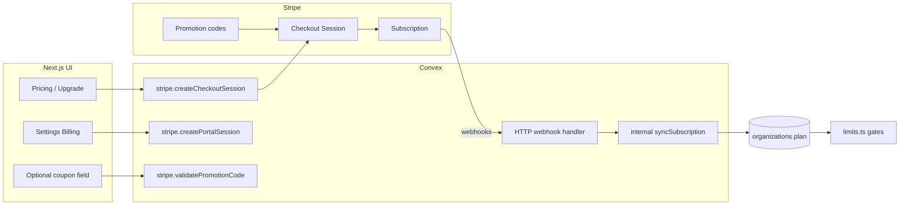

# Stripe billing + coupon support — implementation plan

Plan for replacing **demo billing** (`organizations.updatePlan`) with **Stripe Subscriptions**, including **promotion codes / coupons**, while keeping **`convex/lib/limits.ts`** as the enforcement layer.

---

## Current state

| Layer | Today |
|-------|--------|
| **Plan source of truth** | `organizations.plan` + optional `subscriptionStatus` |
| **Upgrade path** | `updatePlan` mutation — org admin clicks, plan flips instantly |
| **Pricing UI** | `lib/plans.ts`, `pricing-table.tsx`, `upgrade-options.tsx` |
| **Gates** | `convex/lib/limits.ts` reads `ctx.org.plan` only |
| **HTTP** | `convex/http.ts` — auth routes only; no webhooks |
| **Schema** | No `stripeCustomerId`, `stripeSubscriptionId`, or billing metadata |

**Pricing model to mirror in Stripe:**

| Plan | Price | Notes |
|------|-------|--------|
| Free | $0 | No Stripe subscription |
| Pro | $20/mo base + $10/seat after 1st | Max 10 members; monthly + annual ($16/mo-equiv) |
| Enterprise | $99/mo flat | Unlimited members; monthly + annual ($79/mo-equiv) |

---

## Target architecture



### Principles

1. **Stripe is billing source of truth** for paid plans; Convex mirrors via webhooks only (never trust client after checkout).
2. **One Stripe Customer per organization** (B2B workspace billing).
3. **Checkout Sessions** for subscribe/upgrade (not custom PaymentIntents) — supports coupons natively.
4. **Customer Portal** for cancel, payment method, invoices.
5. **Do not** pass `payment_method_types` — use Dashboard payment method config (Stripe best practice).
6. Keep **`updatePlan`** behind `DEMO_BILLING=true` or remove in production.

---

## Stripe catalog setup (Dashboard / CLI)

### Products & prices

Create in Stripe (test mode first):

| Product | Price IDs (store in `lib/stripe-plans.ts`) |
|---------|---------------------------------------------|
| **Manut Pro** | `pro_monthly`, `pro_annual` (licensed **quantity** = billable seats) |
| **Manut Enterprise** | `enterprise_monthly`, `enterprise_annual` (quantity 1) |

**Pro seat model (recommended):**

- **Line 1:** Base price $20/mo (quantity 1) — or fold into per-seat if simpler.
- **Line 2:** Additional seat price $10/mo (quantity = `max(0, memberCount - 1)`).

Simpler alternative: **single licensed price** at $20 for first seat + use Stripe **tiered/volume** pricing — configure once in Dashboard, reference one Price ID per interval.

**Enterprise:** flat recurring price, quantity 1.

### Coupons & promotion codes

| Type | Use case | Stripe object |
|------|----------|---------------|
| **Percent off** | Launch discount (e.g. 20% off 3 months) | Coupon + Promotion code `LAUNCH20` |
| **Fixed amount** | Partner credits | Coupon + Promotion code |
| **Free trial extension** | Sales-led | `trial_period_days` on subscription or coupon `duration: once` |
| **Forever discount** | Early adopters | Coupon `duration: forever` |

**Checkout integration (primary):**

```ts
// Checkout Session — no payment_method_types
{
  mode: "subscription",
  customer: stripeCustomerId,
  line_items: [...],
  allow_promotion_codes: true,  // user enters code on Stripe-hosted page
  subscription_data: { metadata: { orgId, plan: "pro" } },
  success_url: ".../settings/billing?checkout=success",
  cancel_url: ".../pricing?checkout=cancel",
}
```

**Optional in-app coupon field:**

1. User enters code → Convex action `validatePromotionCode` → Stripe `promotionCodes.list({ code, active: true })`.
2. If valid, create Checkout with `discounts: [{ promotion_code: promo.id }]`.
3. Show preview: “20% off for 3 months” from `coupon.percent_off` / `duration`.

---

## Schema changes (requires human approval per AGENTS.md)

Extend `organizations`:

```ts
organizations: {
  // existing
  plan, subscriptionStatus,
  // new
  stripeCustomerId: v.optional(v.string()),
  stripeSubscriptionId: v.optional(v.string()),
  billingPeriod: v.optional(v.union(v.literal("month"), v.literal("annual"))),
  currentPeriodEnd: v.optional(v.number()),
  cancelAtPeriodEnd: v.optional(v.boolean()),
  trialEndsAt: v.optional(v.number()),
}
```

Optional idempotency table:

```ts
stripeWebhookEvents: {
  eventId: v.string(),
  processedAt: v.number(),
}.index("by_event_id", ["eventId"])
```

---

## Convex backend (`convex/stripe/` — new track)

| Function | Type | Purpose |
|----------|------|---------|
| `createCustomer` | internal mutation | Create Stripe customer on org create / first checkout |
| `createCheckoutSession` | action (`"use node"`) | Org admin → Stripe Checkout URL |
| `createPortalSession` | action | Manage subscription / payment method |
| `validatePromotionCode` | action | Optional pre-checkout validation |
| `syncSubscriptionFromStripe` | internal mutation | Map subscription → `plan` + status |
| `syncSeatQuantity` | action | Update Pro subscription quantity on member add/remove |
| `handleWebhook` | httpAction | Verify signature, dispatch events |

### Webhook events to handle

| Event | Action |
|-------|--------|
| `checkout.session.completed` | Link customer/subscription to org |
| `customer.subscription.created` | Set plan + status |
| `customer.subscription.updated` | Plan changes, cancel_at_period_end, past_due |
| `customer.subscription.deleted` | Downgrade to `free` |
| `invoice.payment_failed` | `subscriptionStatus: past_due`; optional grace period |
| `invoice.paid` | `subscriptionStatus: active` |

**Plan mapping:** Store `plan` in subscription metadata (`pro` / `enterprise`) + validate price IDs server-side.

### Seat sync (Pro)

On `members` insert/delete (or scheduled job):

1. Count org members.
2. If Pro subscription active → `stripe.subscriptions.update` with new quantity on seat line item.
3. Enforce `assertUnderSeatLimit` before invite (unchanged).

---

## Next.js / UI changes (Track E)

| Surface | Change |
|---------|--------|
| **`pricing-table.tsx`** | Replace `updatePlan` with `createCheckoutSession({ plan, period, promotionCode? })` → redirect |
| **`upgrade-options.tsx`** | Same + optional coupon input |
| **`upgrade-prompt.tsx`** | Checkout for limit hits |
| **`current-plan-card.tsx`** | “Manage subscription” → Customer Portal; show renewal date, status badge |
| **`settings/billing`** | Portal button, invoice link, applied discount display |
| **New `CouponInput`** | Optional; validates via Convex, passes to checkout |

**Authenticated pricing:** Require active org + org admin for paid checkout (same as today).

**Free plan:** No Stripe — downgrade via Portal cancel or webhook on subscription deleted.

---

## Environment & deployment

| Variable | Where |
|----------|--------|
| `STRIPE_SECRET_KEY` | Convex env (`rk_` restricted key preferred) |
| `STRIPE_WEBHOOK_SECRET` | Convex env |
| `STRIPE_PRICE_PRO_MONTHLY` etc. | Convex env or `lib/stripe-plans.ts` |
| `NEXT_PUBLIC_STRIPE_PUBLISHABLE_KEY` | Only if using Payment Element (not needed for Checkout redirect) |
| `DEMO_BILLING` | Optional; keeps `updatePlan` for dev |

**Webhook URL:** `https://<deployment>.convex.site/stripe-webhook` (register in Stripe Dashboard + CLI for local: `stripe listen --forward-to`).

**Dependencies:** `stripe` npm package in Convex action bundle only (`"use node"` files).

---

## Enforcement (unchanged contract)

- **`limits.ts`** continues to gate on `ctx.org.plan` and `subscriptionStatus` (e.g. block writes on `past_due` after grace).
- Add helper: `assertActiveSubscription(org)` for paid features if status ≠ `active` / `trialing`.
- UI: `useSuiteFeatureAccess` reads org from Convex query — no Stripe client-side.

---

## Migration from demo billing

1. **Phase 1:** Ship Stripe alongside demo — webhook syncs; hide `updatePlan` in prod UI.
2. **Phase 2:** Existing “active” demo orgs — manual Stripe subscription or one-time migration script setting `stripeCustomerId`.
3. **Phase 3:** Remove `updatePlan` from public API or guard with `DEMO_BILLING`.

---

## Implementation phases

| Phase | Scope | Est. |
|-------|--------|------|
| **S0 — Stripe setup** | Products, prices, test coupons, webhook endpoint, env vars | 0.5 day |
| **S1 — Backend core** | Schema, customer creation, checkout + portal actions, webhook handler, sync mutation | 2 days |
| **S2 — UI wiring** | Pricing, upgrade, billing settings → Checkout/Portal | 1 day |
| **S3 — Coupons** | `allow_promotion_codes` on Checkout + optional `CouponInput` + validate action | 0.5 day |
| **S4 — Pro seats** | Quantity sync on member changes | 1 day |
| **S5 — Hardening** | Idempotency, past_due handling, e2e with Stripe test cards, remove demo billing | 1 day |
| **S6 — Go live** | Live mode keys, tax (Stripe Tax optional), Customer Portal config | 0.5 day |

**Total:** ~6–7 days focused work.

---

## Testing checklist

- [ ] Free → Pro monthly checkout (test card `4242…`)
- [ ] Pro → Enterprise upgrade (proration behavior confirmed)
- [ ] Promotion code at Checkout (`allow_promotion_codes`)
- [ ] In-app coupon validation + pre-applied discount
- [ ] Cancel via Portal → webhook → `plan: free`
- [ ] `invoice.payment_failed` → `past_due` → UI upgrade prompt
- [ ] Member invite on Pro updates Stripe quantity
- [ ] Webhook replay / idempotency
- [ ] Non-admin cannot open checkout

---

## Open decisions

1. **Pro pricing in Stripe:** two line items (base + per-seat) vs single tiered price?
2. **Past due:** hard block immediately or 7-day grace?
3. **Annual billing:** Stripe Prices with `interval: year` vs monthly with annual coupon?
4. **Tax:** enable Stripe Tax for US/international?
5. **Enterprise:** self-serve Checkout or sales-only (custom Stripe Price / invoice)?

---

## File ownership (Track E + new billing track)

| Owns |
|------|
| `lib/stripe-plans.ts` (price ID map) |
| `convex/stripe/*`, `convex/http.ts` (one-line webhook route) |
| `components/billing/*` (checkout/portal/coupon UI) |
| Schema change: **`organizations` + webhook table** (coordinate with human) |

---

## Reference

- Current plan display: `lib/plans.ts`
- Demo billing: `convex/organizations.ts` → `updatePlan`
- Gates: `convex/lib/limits.ts`
- Stripe integration guidance: Checkout Sessions + `allow_promotion_codes`; no `payment_method_types` except Terminal
